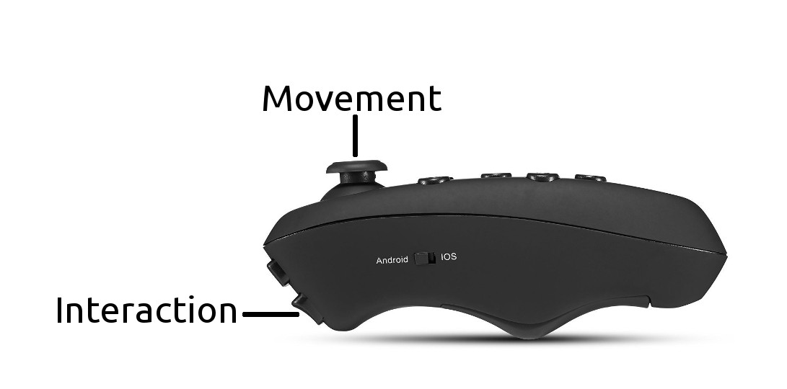

# BombermanVR

First Person Bomberman Android game using Virtual Reality features.

## Requirements

* [Unity 5.5.1](https://unity3d.com/de/get-unity/download/archive)
* [Android SDK](https://developer.android.com/studio/index.html#downloads)  
* [Android Bluetooth Game Controller](https://www.amazon.de/Controller-Fernbedienung-Smartphones-Batteriebetrieb-schwarz-matt/dp/B01MDU3NUK)

## Installation

1. Connect your Android Device via [adb](https://developer.android.com/studio/command-line/adb.html).
2. Import the project using Unity.
3. Go to `File` -> `Build Settings`.
4. Choose `Android` as the target platform and click on `Switch Platform`.
5. Click on `Build And Run`. After some time the game should start on the mobile device.

## Documentation

The documentation is located inside the [Documentation folder](Documentation/)

## Game

  Players can either act as _Host_ or _Client_.

  For _Host_-mode choose `Create Game`. For _Client_-mode choose `Join Game`.

  Up to 4 players can join a game. Inside the Lobby, all players have to indicate they are ready by pressing on the `Join`-button. When all players are ready, the game starts.

  The player controlls its character by using a bluetooth controller. Before usage the controller has to be set to _VR-mode_ by pressing `@`+`C` on it.

  The following picture shows how to use the controller during gameplay.

  

  After The game ends a leaderboard shows each players rank, name and survival time. From there each player can return to the main menu and start a new game.

## Credits

* [Kenney](http://kenney.nl/) - UI Graphics and Font
* [OpenGameArt](http://opengameart.org/) - Game sound
